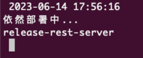

htl 自用工具

## 功能
检查deployment和cloneset的启动情况,启动完成就发送飞书通知

项目使用cobra构建,参照了kubecm的使用方法.

### 示例
```shell
# 检查deployment
htl status
# 检查cloneset
htl status -t clo
```
### 效果如下




## 自定义config
配置目录 ~/.htl/config.yaml
```yaml
feishubot:
  # 默认的飞书机器人地址
  add: https://open.feishu.cn/open-apis/bot/v2/hook/daa4ff06-226a-4fdc-8c26-2e049e618ad5
  # 发送的信息文本
  msg: "服务重启完成"
dump:
  # 存储javadump的deployment名称
  ossRs: centos
  # javadump的存放路径
  ossPath: "/javatmp/"
```
## Feature

### 检测服务状态

- 多种资源类型要实时监控状态，报告异常的 pod
- 发送机器人消息，可以使用 xml 或者 yaml 定义机器人和发送消息文本

### 批量停止、启动服务

- 将副本数置为 0，并将副本数保存，方便下次拉起

### 支持 dump并上传至oss

- 执行命令
### top命令增强
- 基于某台机器上的pod top

### 支持 SSH(kubectl node-shell插件可满足)

- SSH node


1. Windows 64位：
```
export GOOS=windows
export GOARCH=amd64
```

2. Windows 32位：
```
export GOOS=windows
export GOARCH=386
```

3. macOS 64位（Intel）：
```
export GOOS=darwin
export GOARCH=amd64
```

4. macOS 64位（Apple Silicon）：
```
export GOOS=darwin
export GOARCH=arm64
```

5. Linux 64位：
```
export GOOS=linux
export GOARCH=amd64
```

6. Linux 32位：
```
export GOOS=linux
export GOARCH=386
```
